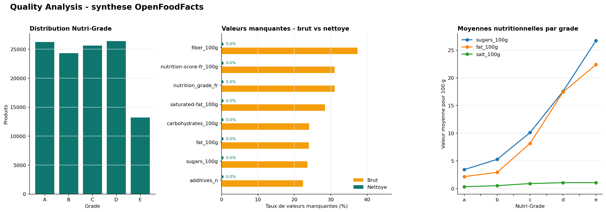
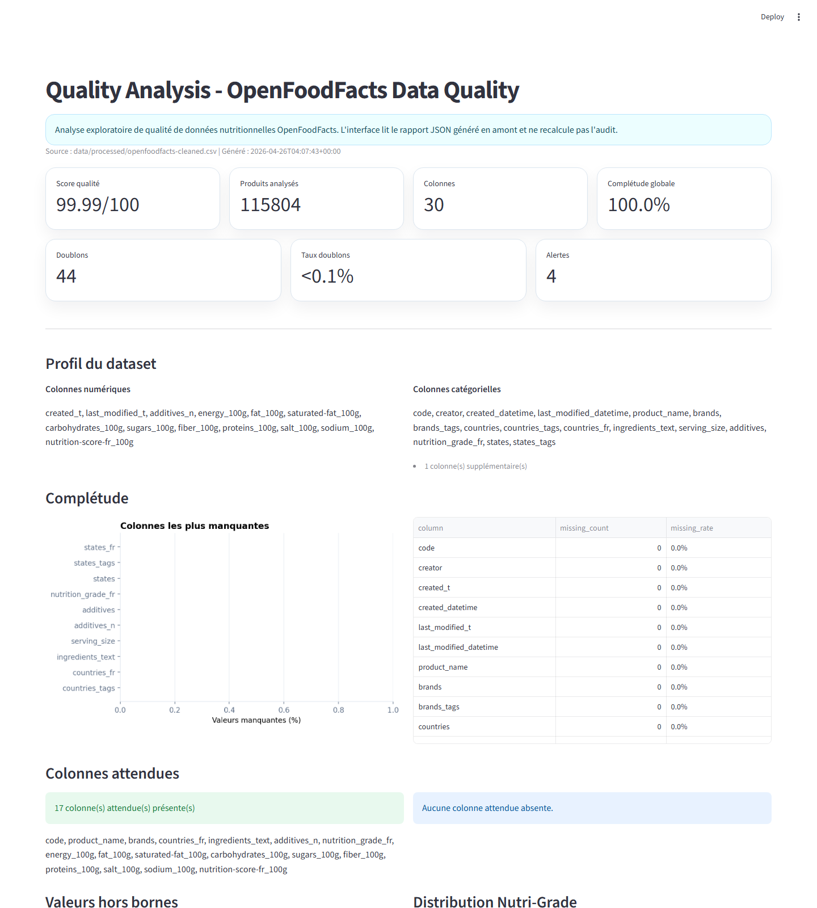

# Quality Analysis - OpenFoodFacts Nutrition Data Quality


## Présentation du projet

Quality Analysis est un projet Data Science orienté qualité de données nutritionnelles. Il part d'un export OpenFoodFacts volumineux et bruité pour construire une base exploitable, analyser les valeurs nutritionnelles et vérifier la cohérence des Nutri-Grades.

Le projet est volontairement positionné comme un MVP analytique local : il ne s'agit pas d'une application santé en production, ni d'un système de recommandation alimentaire. L'objectif est de montrer une démarche claire de nettoyage, validation, exploration statistique et documentation.

## Aperçu

Le visuel ci-dessous est reconstruit depuis les données locales et résume trois sorties clés : distribution des Nutri-Grades, réduction des valeurs manquantes sur les variables utiles et moyennes nutritionnelles par grade.



## Objectif métier

Le cas d'usage se place du point de vue d'un organisme de santé publique qui souhaite améliorer la qualité d'une base collaborative de produits alimentaires.

Les objectifs principaux sont :

- identifier les colonnes trop incomplètes ;
- fiabiliser les variables nutritionnelles utiles ;
- limiter l'impact des valeurs aberrantes ;
- analyser les liens entre nutriments et Nutri-Grade ;
- produire une base nettoyée exploitable pour des analyses futures ;
- documenter les limites et les règles de traitement.

## Source de données

Le dataset brut attendu est un export OpenFoodFacts local :

```text
data/raw/openfoodfacts-products.tsv
```

Dans la copie locale auditée, le fichier brut contient environ `320 772` produits et `162` colonnes. Le fichier nettoyé local contient environ `115 804` produits et `30` colonnes.

Les données complètes ne sont pas versionnées, car elles sont volumineuses et reconstruisibles. Le dépôt contient uniquement un petit échantillon dans `data/sample/` pour les tests, les exemples et la lecture rapide.

## Architecture du dépôt

```text
.
|-- app/                         # Interface Streamlit locale
|-- data/
|   |-- sample/                  # Echantillon versionné
|   |-- raw/                     # Dataset brut local non versionné
|   `-- processed/               # Exports nettoyés locaux non versionnés
|-- docs/                        # Documentation synthétique
|-- notebooks/                   # Notebook exploratoire principal
|-- reports/                     # Rapports qualité générés
|-- scripts/                     # Commandes Python simples
|-- src/quality_analysis/        # Logique stabilisée et testable
|-- tests/                       # Tests unitaires légers
|-- requirements-app.txt
|-- requirements.txt
|-- requirements-dev.txt
`-- README.md
```

## Pipeline analytique

Le socle Python extrait une première base réutilisable depuis le notebook existant :

- `loaders.py` charge le brut, le nettoyé ou l'échantillon ;
- `cleaning.py` applique les règles de nettoyage stabilisées ;
- `quality_checks.py` produit des rapports de complétude, doublons et bornes ;
- `analysis.py` regroupe les analyses Nutri-Grade, ANOVA et PCA ;
- `profiling.py` décrit le profil général du dataset ;
- `scoring.py` calcule un score qualité simple et explicable ;
- `reporting.py` génère les rapports JSON, Markdown et HTML ;
- `export.py` centralise les exports CSV.

Le notebook reste la trace exploratoire complète. Le package `src/quality_analysis/` contient uniquement la partie stabilisée et testable.

## Stratégie de nettoyage

Le nettoyage repose sur des règles simples et explicables :

- suppression des colonnes trop incomplètes ;
- sélection des colonnes nutritionnelles utiles ;
- normalisation des Nutri-Grades ;
- contrôle de bornes métier sur les valeurs pour 100 g ;
- suppression des doublons disponibles ;
- imputation médiane sur les variables numériques.

Ces règles ne prétendent pas remplacer une validation experte nutritionnelle. Elles donnent une base robuste pour l'analyse exploratoire.

## Analyses statistiques

Le notebook et les modules couvrent plusieurs angles :

- distribution des Nutri-Grades ;
- moyennes nutritionnelles par grade ;
- analyse des valeurs manquantes ;
- PCA pour explorer la structure des variables numériques ;
- ANOVA pour tester les différences entre groupes Nutri-Grade ;
- CCA et LDA dans le notebook exploratoire.

Aucun résultat n'est inventé dans la documentation : les chiffres doivent être reconstruits à partir des données locales.

## Rapport qualité

Le projet peut générer un rapport d'audit qualité reproductible :

```bash
python scripts/generate_quality_report.py
```

Le script charge en priorité `data/processed/openfoodfacts-cleaned.csv` si le fichier existe localement. Sinon, il utilise l'échantillon versionné `data/sample/openfoodfacts-cleaned-sample.csv`.

Les sorties générées sont :

- `reports/quality_report.json` : structure exploitable par une future interface ;
- `reports/quality_report.md` : synthèse lisible dans GitHub ;
- `reports/quality_report.html` : version statique consultable localement.

Le score qualité est volontairement simple. Il combine complétude, colonnes attendues, bornes nutritionnelles, doublons et cohérence des Nutri-Grades. Il sert au pilotage technique du nettoyage, pas à une validation scientifique ou réglementaire.

## Interface locale

Une interface Streamlit locale permet de visualiser le rapport qualité généré en phase 2 :



```bash
pip install -r requirements-app.txt
python scripts/generate_quality_report.py
streamlit run app/streamlit_app.py
```

L'interface lit uniquement `reports/quality_report.json`. Elle ne recalcule pas l'analyse depuis le CSV et ne nécessite pas le dataset complet si l'échantillon versionné est disponible.

Cette interface est une démonstration locale portfolio : elle ne fournit pas d'API, ne sert pas de service en production et ne formule aucune promesse santé.

## Données générées

Fichiers locaux attendus ou générés :

- `data/raw/openfoodfacts-products.tsv` : dataset brut, non versionné ;
- `data/processed/openfoodfacts-cleaned.csv` : dataset nettoyé, non versionné ;
- `data/sample/openfoodfacts-cleaned-sample.csv` : échantillon léger versionné ;
- `reports/quality_report.json` : rapport qualité structuré ;
- `reports/quality_report.md` : rapport qualité Markdown ;
- `reports/quality_report.html` : rapport qualité HTML.

## Installation locale

```bash
python -m venv .venv
.\.venv\Scripts\Activate.ps1
pip install -r requirements.txt -r requirements-dev.txt
```

Installer uniquement l'interface Streamlit :

```bash
pip install -r requirements-app.txt
```

## Commandes principales

Reconstruire le dataset nettoyé :

```bash
python scripts/build_clean_dataset.py
```

Reconstruire l'échantillon versionné depuis le nettoyé local :

```bash
python scripts/build_sample.py
```

Générer le rapport qualité :

```bash
python scripts/generate_quality_report.py
```

Lancer l'interface locale :

```bash
streamlit run app/streamlit_app.py
```

Ouvrir le notebook :

```bash
jupyter lab
```

Lancer les tests :

```bash
pytest
```

## Tests

Les tests ne dépendent pas du dataset complet. Ils couvrent :

- suppression des colonnes trop incomplètes ;
- contrôle de bornes nutritionnelles ;
- imputation médiane ;
- distribution des Nutri-Grades ;
- rapports de colonnes attendues ;
- ANOVA et PCA sur jeux fictifs ;
- profil dataset, score qualité et génération de rapport ;
- chargement du rapport et génération des graphiques de visualisation.

## Limites actuelles

- Le dataset complet doit être récupéré ou conservé localement.
- Le notebook reste exploratoire et contient plus de visualisations que le package Python.
- Les règles de bornes sont simples et doivent être documentées si elles évoluent.
- L'interface Streamlit est locale et lit un rapport statique.
- Le projet ne fournit pas d'API, de backend ou de modèle de prédiction en production.

## Améliorations possibles

- Générer un tableau de synthèse des règles appliquées.
- Ajouter des tests de non-régression sur un échantillon contrôlé.
- Extraire davantage de visualisations du notebook vers des fonctions réutilisables.
- Ajouter une capture réelle de l'interface si elle est générée localement.

## Contexte du projet

Ce dépôt reprend un ancien travail de préparation de données et le remet en forme comme projet portfolio Data Science. Il démontre la capacité à traiter une base volumineuse, bruitée et incomplète, puis à construire une démarche analytique claire autour de la qualité nutritionnelle.
